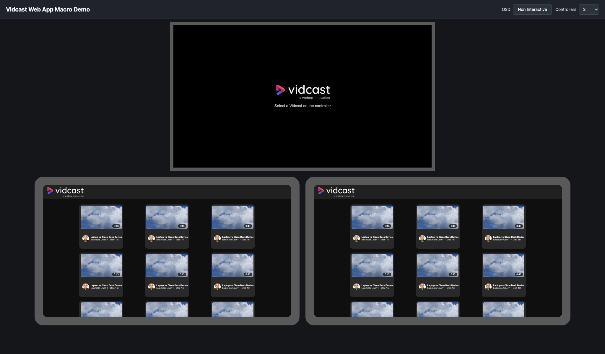

# Vidcast Web App Macro

This proof of concept opens a Vidcast playlist on a RoomOS device and lets a paired Room Navigator control playback.



## Overview

The RoomOS macro adds a Vidcast launch button, fetches videos from a configured Vidcast playlist, and opens two WebViews: an OSD player and a controller UI. The web app uses WebRTC data channels between those WebViews to sync video selection, playback state, seek position, and sharing state.

## Prerequisites

- A Cisco RoomOS device with macros and WebView support.
- A paired Room Navigator or controller target.
- A Vidcast playlist ID configured in [macro/vidcast.js](macro/vidcast.js).
- The Vidcast playlist must be public. Private playlists require additional authentication that this demo does not implement.

## Setup

The macro is functional without setting up your own web server. The required web app is already hosted on GitHub Pages, and the default `playerUrl` in [macro/vidcast.js](macro/vidcast.js) should point to that hosted copy.

1. Update the macro configuration in [macro/vidcast.js](macro/vidcast.js) with your public Vidcast playlist ID:

   ```js
   const config = {
     vidcast: {
       playlistId: "YOUR_PUBLIC_PLAYLIST_ID",
     },
   };
   ```

   Leave `playerUrl` unchanged unless you want to self-host or modify the web app.

2. Upload [macro/vidcast.js](macro/vidcast.js) to the RoomOS device macro editor and enable it.

3. Press the Vidcast button on the device UI. The macro opens the player on the OSD and controls on the paired controller.

## Self-Hosting

Self-hosting is optional. If you want to change the web app, host the contents of `webapp/` on an HTTPS endpoint that the RoomOS device can reach, then update `playerUrl` in [macro/vidcast.js](macro/vidcast.js) to your hosted `index.html`.

## Local Demo

The local demo runs the same web app in browser iframes, with one OSD and multiple controller surfaces.

```sh
npm install
npm run serve:web
```

Then open `http://127.0.0.1:4173/demo.html`.

## Tests

```sh
npm test
```

## Notes

- This is a demo and proof of concept, so expect rough edges.
- The macro creates a temporary local integration account so the WebViews can request playlist data from the device.
- Controller state is synced through WebRTC data channels between the WebViews.

## Demo

Try the hosted browser demo here: [https://wxsd-sales.glitch.io/vidcast-webapp-macro/webapp/demo.html](https://wxsd-sales.glitch.io/vidcast-webapp-macro/webapp/demo.html)

*For more demos & PoCs like this, check out our [Webex Labs site](https://collabtoolbox.cisco.com/webex-labs).*

## License

All contents are licensed under the MIT license. Please see [license](LICENSE) for details.

## Disclaimer

Everything included is for demo and Proof of Concept purposes only. Use of the site is solely at your own risk. This site may contain links to third party content, which we do not warrant, endorse, or assume liability for. These demos are for Cisco Webex usecases, but are not Official Cisco Webex Branded demos.

## Questions

Please contact the WXSD team at [wxsd@external.cisco.com](mailto:wxsd@external.cisco.com?subject=vidcast-webapp-macro) for questions. Or, if you're a Cisco internal employee, reach out to us on the Webex App via our bot (globalexpert@webex.bot). In the "Engagement Type" field, choose the "API/SDK Proof of Concept Integration Development" option to make sure you reach our team.
